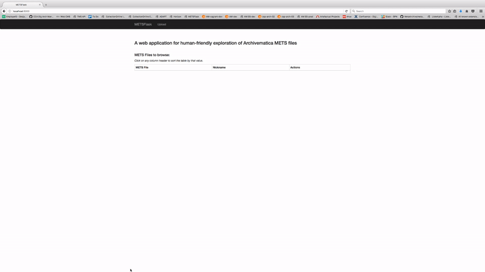

# METSFlask  

A web application for human-friendly exploration of Archivematica METS files.

## Live site (try it out!):  
[http://bitarchivist.pythonanywhere.com/](http://bitarchivist.pythonanywhere.com/)  

All files uploaded to METSFlask are deleted after being read into the database. Database entries are deletable by all users at any time. That is to say - feel free to upload and view your own files! You can delete them from the web app as soon as you're done.  

## Install locally (dev):  
(Tested with Python 2.7 and 3.5. It's recommended that you use Python 3, as there could be some Unicode handling issues with Python 2.)  

* Clone files and cd to directory:  
`git clone https://github.com/timothyryanwalsh/METSFlask && cd METSFlask`  
* Set up virtualenv:  
`virtualenv venv`  
* Activate virtualenv:  
`source venv/bin/activate`  
* Install requiremenents:  
`pip install -r requirements.txt`   
* Create database:  
`chmod a+x db_create.py`    
`./db_create.py`  
* Run (on localhost, port 5000):  
`./run.py`  
* Go to `localhost:5000` in browser.  

## Detailed identification and dates

METSFlask works best when the amdSec for every file in an AIP contains characterization information from FITS. The ExifTool raw output in the "Detailed identification" section of detailed page views and the last modified date used in both the AIP table view and detailed page views rely on FITS information being present in the amdSec. These elements will appear blank in METSFlask for file types that are not set to be characterized by FITS in your local Archivematica FPR.  

Since Archivematica 1.4, FITS is not set as a default Characterization tool for all file types. To enable FITS as a characterization tool for all files (in addition to other more specific tools run on specific file types) in Archivematica 1.6, Artefactual has created an "ensure-fits-characterization" script as part of the [archivematica-devtools repo](https://github.com/artefactual/archivematica-devtools/tree/dev/issue-11019-ensure-fits-characterization).

To enable FITS characterization for all files in Archivematica 1.6, first clone the Archivematica-devtools repo and then:  
* `cd /path/to/archivematica-devtools`  
* `git checkout dev/issue-11019-ensure-fits-characterization`  
* `sudo make install`  
* `sudo am ensure-fits-characterization`

## PUID links

The table of original files for each AIP and detailed pages for each digital file contain links to PRONOM for particular PUIDs. These links will resolve for all identifications if Siegfried was used as the identification tool. If Fido was used, links to format entries in PRONOM (e.g. "fmt/#" or "x-fmt/#") should resolve; Fido entries (e.g. "fido-fmt/189.word") will not. 
